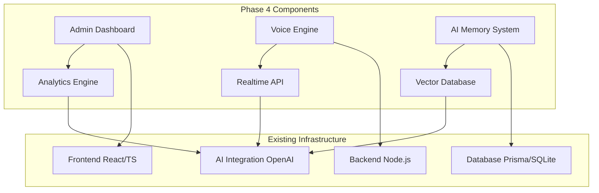

# 🚀 Phase 4 System Blueprint: Mbarie FMS AI
## Advanced Dashboard + Voice Engine + AI Memory Integration

---

## 📋 Executive Summary

**Phase 4** transforms Mbarie FMS AI from a functional prototype into a **production-ready, enterprise-grade AI facility management platform** with advanced analytics, realtime voice capabilities, and persistent AI memory.

---

## 🎯 Phase 4 Objectives

### 1. **Advanced Admin Dashboard**
- Real-time communication analytics
- AI monitoring insights visualization  
- Email routing optimization metrics
- Personnel interaction tracking
- System health monitoring

### 2. **Realtime Voice Engine**
- OpenAI Realtime Voice API integration
- Streaming voice I/O capabilities
- Voice command processing
- Multimodal conversation continuity

### 3. **AI Memory System**
- Persistent chat history
- Context-aware conversations
- Personnel interaction memory
- Learning from past communications

---

## 🏗️ Architecture Overview



---

## 🎛️ 1. Advanced Admin Dashboard

### Core Components

#### 1.1 Dashboard Layout Structure
```typescript
interface DashboardLayout {
  header: {
    systemStatus: 'healthy' | 'warning' | 'error'
    activeUsers: number
    aiAgentStatus: 'active' | 'idle' | 'processing'
  }
  sidebar: NavigationMenu
  main: {
    analytics: AnalyticsPanel
    communications: CommunicationsPanel
    monitoring: MonitoringPanel
  }
}
```

#### 1.2 Analytics Panel
**Features:**
- Real-time communication volume charts
- Department-wise interaction metrics
- AI response time tracking
- Email approval workflow analytics
- Voice vs text usage statistics

**Implementation:**
```typescript
// src/components/dashboard/AnalyticsPanel.tsx
interface AnalyticsData {
  dailyCommunications: CommunicationMetric[]
  departmentActivity: DepartmentMetric[]
  aiPerformance: AIPerformanceMetric[]
  voiceUsage: VoiceUsageMetric[]
}

// Charts: Recharts or Chart.js integration
// Real-time updates: WebSocket connections
```

#### 1.3 Communications Panel
**Features:**
- Live communication feed
- Search and filter capabilities
- Export functionality
- Conversation quality scoring

**Implementation:**
```typescript
// src/components/dashboard/CommunicationsPanel.tsx
interface CommunicationLog {
  id: string
  timestamp: Date
  user: string
  department: string
  type: 'text' | 'voice' | 'email'
  content: string
  aiResponse: string
  sentiment: number
  resolved: boolean
}
```

#### 1.4 Monitoring Panel
**Features:**
- AI agent health monitoring
- System resource usage
- Error tracking and alerts
- Performance optimization suggestions

---

## 🔊 2. Realtime Voice Engine

### Architecture Design

#### 2.1 Voice Processing Pipeline
```typescript
interface VoiceEngine {
  // Input Processing
  audioCapture: AudioCaptureService
  speechToText: SpeechToTextService
  realtimeAPI: OpenAIVoiceAPI
  
  // Output Processing  
  textToSpeech: TextToSpeechService
  audioPlayback: AudioPlaybackService
  
  // Integration
  chatIntegration: ChatIntegrationService
  memoryIntegration: MemoryIntegrationService
}
```

#### 2.2 OpenAI Realtime Voice API Integration
**Implementation Strategy:**
```typescript
// src/services/VoiceEngine.ts
class VoiceEngineService {
  private realtimeConnection: WebSocket
  private audioContext: AudioContext
  private mediaRecorder: MediaRecorder
  
  async initializeVoiceSession(): Promise<void> {
    // Connect to OpenAI Realtime API
    // Set up audio capture and playback
    // Initialize conversation context
  }
  
  async processVoiceInput(audioData: ArrayBuffer): Promise<VoiceResponse> {
    // Stream audio to OpenAI
    // Receive realtime transcriptions
    // Generate AI responses
    // Convert to speech output
  }
  
  async handleVoiceCommand(command: string): Promise<void> {
    // Process voice commands
    // Execute system actions
    // Update dashboard state
  }
}
```

#### 2.3 Voice Command System
**Supported Commands:**
- "Show me recent communications"
- "What's the system status?"
- "Generate email draft for [department]"
- "Monitor facility operations"
- "Analyze communication patterns"

---

## 🧠 3. AI Memory System

### Architecture Design

#### 3.1 Memory Storage Structure
```typescript
interface AIMemorySystem {
  // Short-term Memory (Session-based)
  sessionMemory: SessionMemoryStore
  
  // Long-term Memory (Persistent)
  vectorDatabase: VectorDatabase
  relationalDatabase: RelationalDatabase
  
  // Memory Retrieval
  semanticSearch: SemanticSearchEngine
  contextBuilder: ContextBuilder
}
```

#### 3.2 Vector Database Integration
**Technology Stack:**
- **Primary:** PostgreSQL with pgvector extension
- **Alternative:** Pinecone or ChromaDB
- **Embeddings:** OpenAI text-embedding-3-small

**Implementation:**
```typescript
// src/services/MemoryService.ts
class MemoryService {
  async storeConversation(conversation: Conversation): Promise<void> {
    // Generate embeddings for conversation
    // Store in vector database
    // Link to relational data
  }
  
  async retrieveRelevantContext(query: string, userId?: string): Promise<MemoryContext> {
    // Semantic search for relevant past conversations
    // Filter by user/department if provided
    // Build context for AI prompt
  }
  
  async learnFromInteraction(interaction: AIInteraction): Promise<void> {
    // Analyze successful interactions
    // Update conversation patterns
    // Improve future responses
  }
}
```

#### 3.3 Context-Aware Conversations
**Features:**
- Remember user preferences and history
- Maintain conversation continuity
- Learn from past successful interactions
- Personalize responses based on user role

---

## 🔧 Technical Implementation Details

### 4.1 Backend API Extensions

#### New Routes:
```typescript
// server/src/routes/dashboard.ts
router.get('/dashboard/analytics', getDashboardAnalytics)
router.get('/dashboard/communications', getCommunicationLogs)
router.post('/dashboard/export', exportDashboardData)

// server/src/routes/voice.ts  
router.post('/voice/session', createVoiceSession)
router.ws('/voice/realtime', handleRealtimeVoice)
router.post('/voice/command', processVoiceCommand)

// server/src/routes/memory.ts
router.post('/memory/store', storeConversationMemory)
router.get('/memory/context', getConversationContext)
router.post('/memory/learn', learnFromInteraction)
```

### 4.2 Frontend Components

#### New Components Structure:
```
client/src/components/dashboard/
├── AnalyticsPanel.tsx
├── CommunicationsPanel.tsx
├── MonitoringPanel.tsx
├── VoiceInterface.tsx
└── MemorySettings.tsx

client/src/services/
├── VoiceEngineService.ts
├── MemoryService.ts
└── DashboardService.ts
```

### 4.3 Database Schema Extensions

#### Memory Tables:
```sql
-- Conversation memory table
CREATE TABLE conversation_memory (
  id UUID PRIMARY KEY DEFAULT gen_random_uuid(),
  user_id UUID REFERENCES users(id),
  conversation_text TEXT NOT NULL,
  embedding VECTOR(1536), -- OpenAI embeddings
  metadata JSONB,
  created_at TIMESTAMP DEFAULT NOW()
);

-- Voice session logs
CREATE TABLE voice_sessions (
  id UUID PRIMARY KEY DEFAULT gen_random_uuid(),
  user_id UUID REFERENCES users(id),
  session_data JSONB,
  duration_seconds INTEGER,
  created_at TIMESTAMP DEFAULT NOW()
);

-- Dashboard analytics cache
CREATE TABLE analytics_cache (
  id UUID PRIMARY KEY DEFAULT gen_random_uuid(),
  metric_type VARCHAR(100),
  time_period VARCHAR(50),
  data JSONB,
  computed_at TIMESTAMP DEFAULT NOW()
);
```

---

## 🚀 Deployment & Production Readiness

### 5.1 Environment Configuration
```env
# Voice Engine
OPENAI_REALTIME_API_KEY=your_realtime_api_key
VOICE_SESSION_TIMEOUT=300
MAX_VOICE_DURATION=600

# Memory System
VECTOR_DB_CONNECTION_STRING=postgresql://...
MEMORY_RETENTION_DAYS=90
EMBEDDING_MODEL=text-embedding-3-small

# Dashboard
ANALYTICS_CACHE_DURATION=300
MAX_EXPORT_RECORDS=10000
```

### 5.2 Docker Compose Updates
```yaml
services:
  # Existing services...
  
  # Vector Database (if using separate instance)
  vector-db:
    image: pgvector/pgvector:pg16
    environment:
      POSTGRES_DB: mbarie_memory
      POSTGRES_USER: admin
      POSTGRES_PASSWORD: ${VECTOR_DB_PASSWORD}
    ports:
      - "5433:5432"
    volumes:
      - vector_data:/var/lib/postgresql/data

volumes:
  vector_data:
```

### 5.3 Performance Optimization
- **Caching:** Redis for dashboard analytics
- **CDN:** For voice audio files
- **Compression:** Brotli for API responses
- **Monitoring:** Prometheus + Grafana integration

---

## 🧪 Testing Strategy

### 6.1 Unit Tests
```typescript
// Voice engine tests
describe('VoiceEngineService', () => {
  test('should process voice input correctly', () => {})
  test('should handle voice commands', () => {})
  test('should maintain session state', () => {})
})

// Memory service tests  
describe('MemoryService', () => {
  test('should store and retrieve conversations', () => {})
  test('should perform semantic search', () => {})
  test('should build context correctly', () => {})
})
```

### 6.2 Integration Tests
- Voice session end-to-end testing
- Dashboard data flow testing
- Memory system integration testing

### 6.3 Performance Tests
- Voice latency measurements
- Memory retrieval speed tests
- Dashboard load testing

---

## 📈 Success Metrics

### 7.1 Performance Targets
- **Voice Response Time:** < 2 seconds
- **Memory Retrieval:** < 500ms
- **Dashboard Load Time:** < 3 seconds
- **System Uptime:** > 99.5%

### 7.2 User Experience Goals
- **Voice Accuracy:** > 95% transcription accuracy
- **Context Relevance:** > 90% relevant memory recall
- **Dashboard Usability:** < 2 clicks to key information

---

## 🔄 Development Phasing

### Phase 4.1: Foundation (Week 1-2)
- [ ] Set up vector database
- [ ] Implement basic memory storage
- [ ] Create dashboard skeleton
- [ ] Integrate OpenAI Realtime API

### Phase 4.2: Core Features (Week 3-4)
- [ ] Build analytics panels
- [ ] Implement voice command system
- [ ] Add context-aware conversations
- [ ] Create communication visualization

### Phase 4.3: Polish & Optimization (Week 5-6)
- [ ] Performance optimization
- [ ] User testing and refinement
- [ ] Production deployment preparation
- [ ] Documentation and training materials

---

## 🎯 Next Steps for Cline

1. **Analyze current codebase** for integration points
2. **Set up development environment** with new dependencies
3. **Implement Phase 4.1 foundation components**
4. **Test voice and memory integration**
5. **Iterate based on performance metrics**

This blueprint provides Cline with a comprehensive roadmap to transform Mbarie FMS AI into a fully-featured, production-ready AI facility management platform with advanced voice capabilities, persistent memory, and comprehensive analytics.
